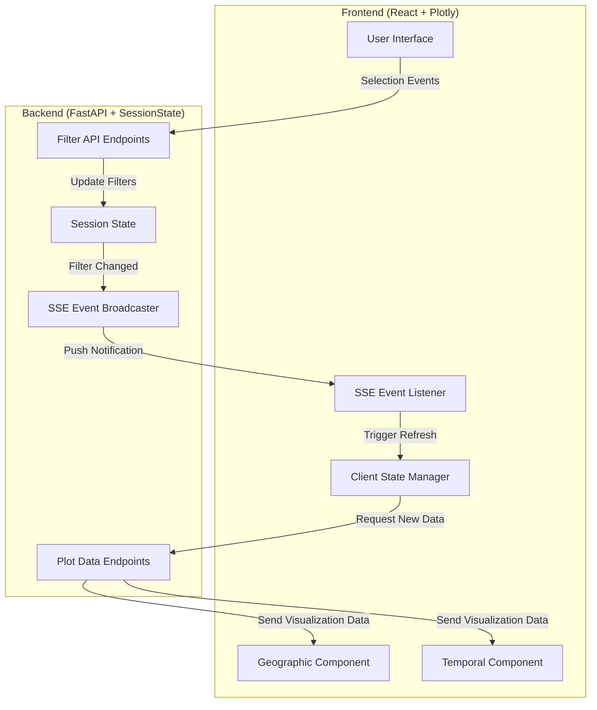
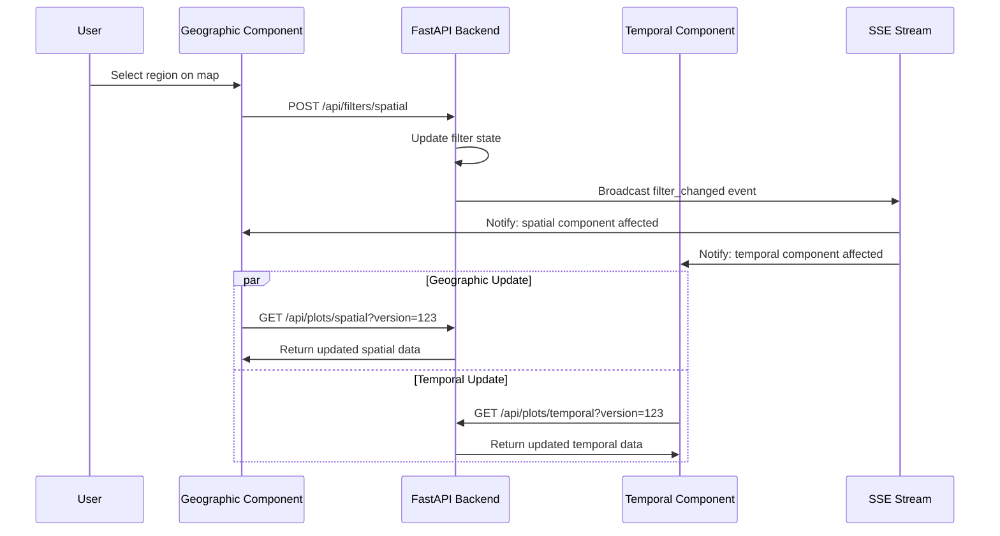

# Frontend/Backend Architecture for Crossfilter

## Design Overview

This document outlines a reactive frontend/backend architecture that keeps state in the backend while providing efficient, real-time updates to visualization components.

## ✅ Implemented Features

### Filter to Selected Points
A simplified implementation of frontend-to-backend communication for filtering plots to user-selected data points:

- **Frontend UI**: "Filter to Selected" button positioned underneath plots, enabled only when points are selected
- **Plot-Agnostic Design**: Uses `event_source` field with `FilterOperationType` to handle different plot types (temporal, spatial, etc.)
- **Plotly Selection Integration**: Leverages Plotly's built-in selection mechanisms (lasso, box select) instead of complex viewport tracking
- **Smart Filtering**: Converts plot-level df_ids (which may be buckets) to original dataframe point filtering
- **Backend Processing**: Uses `filter_df_to_selected_buckets()` to correctly map plot df_ids to original dataframe rows
- **Extensible Architecture**: Single endpoint handles all plot types with different event sources
- **Simplified Testing**: Essential UI verification test ensures core functionality works

#### Technical Details
- **Backend Endpoint**: Single `/api/filters/df_ids` endpoint that accepts `event_source` parameter
- **Frontend Enum**: `FilterOperationType` constant matching backend schema for type safety
- **Simplified Implementation**: `filterToSelected(eventSource)` method uses existing selection tracking
- **Temporal Convenience Method**: `filterTemporalToSelected()` wrapper for temporal plot filtering
- **Button State Management**: Button disabled until user makes a selection, with selection count display
- **Error Handling**: Returns 501 for spatial filtering (not yet implemented) and 400 for invalid event sources

#### Architectural Benefits
- **Much Simpler Code**: Removed ~80 lines of complex viewport tracking and visible point calculation
- **Uses Plotly Strengths**: Leverages Plotly's robust selection events instead of reinventing them
- **Better UX**: Users explicitly select what they want to filter to, making intent clear
- **More Reliable**: Plotly's selection handling is more robust than manual coordinate calculations
- **Easier Testing**: UI verification is simpler than simulating complex zoom/selection interactions

## Key Design Principles

1. **Backend State Management**: All filtering state and large datasets remain on the backend
2. **Reactive Updates**: When filters change, backend pushes notifications to frontend components  
3. **Component-Specific APIs**: Different visualization types have tailored update mechanisms
4. **Single Session**: Leverages the existing single-session architecture for simplicity
5. **Progressive Enhancement**: Builds on existing FastAPI + Plotly foundation

## Architecture Diagram



## Communication Patterns

### 1. Filter Operations (Frontend → Backend)

Different visualization components POST their selections using component-specific endpoints:

```javascript
// Geographic selections (bounding box, lasso selection)
POST /api/filters/spatial
{
  "selection_type": "bbox|lasso|visible_viewport", 
  "selection_data": {...},
  "operation": "apply|intersect"
}

// Temporal selections (time range, CDF selections)  
POST /api/filters/temporal
{
  "selection_type": "time_range|cdf_selection|visible_range",
  "selection_data": {...},
  "operation": "apply|intersect"
}
```

### 2. State Change Notifications (Backend → Frontend)

Backend uses **Server-Sent Events (SSE)** to push filter change notifications:

```javascript
// Frontend subscribes to state changes
const eventSource = new EventSource('/api/events/filter-changes');

eventSource.onmessage = (event) => {
  const update = JSON.parse(event.data);
  // update.type: "filter_applied" | "filter_reset" | "data_loaded"
  // update.affected_components: ["geographic", "temporal"]
  handleStateUpdate(update);
};
```

### 3. Data Requests (Frontend → Backend)

After receiving state change notifications, components request updated visualization data:

```javascript
// Geographic component requests spatial aggregation
GET /api/plots/spatial?max_groups=100000&version=${filterVersion}

// Temporal component requests temporal aggregation  
GET /api/plots/temporal?max_groups=100000&version=${filterVersion}

// Alternative: Request ready-to-display HTML (for simpler integration)
GET /api/plots/temporal/html?max_groups=100000
```

## Plot Data Wire Formats

The backend supports two wire formats for delivering plot data:

- **JSON format** (`/api/plots/temporal`): Returns Plotly figure data for client-side rendering and full interaction support
- **HTML format** (`/api/plots/temporal/html`): Returns ready-to-display HTML with embedded Plotly visualization for simple integration

## Component Architecture

### Frontend: React + Plotly Components

```jsx
// Main application component
function CrossfilterApp() {
  const [filterState, setFilterState] = useState(null);
  const [plotVersions, setPlotVersions] = useState({});
  
  // SSE connection for state updates
  useEffect(() => {
    const eventSource = new EventSource('/api/events/filter-changes');
    eventSource.onmessage = handleFilterUpdate;
    return () => eventSource.close();
  }, []);
  
  return (
    <div>
      <GeographicVisualization 
        version={plotVersions.spatial}
        onSelection={handleSpatialSelection}
      />
      <TemporalVisualization
        version={plotVersions.temporal} 
        onSelection={handleTemporalSelection}
      />
    </div>
  );
}

// Geographic visualization component
function GeographicVisualization({ version, onSelection }) {
  const [plotData, setPlotData] = useState(null);
  
  // Refresh when version changes (triggered by filter updates)
  useEffect(() => {
    if (version) fetchSpatialData().then(setPlotData);
  }, [version]);
  
  // Embed Plotly/Kepler.gl and handle selections
  return (
    <div ref={plotRef}>
      {/* Plotly plot with selection callbacks */}
    </div>
  );
}
```

### Backend: Enhanced FastAPI Endpoints

```python
# New SSE endpoint for push notifications
@app.get("/api/events/filter-changes")
async def filter_change_stream():
    return EventSourceResponse(session_state.filter_change_stream())

# Enhanced filter endpoint with broadcasting
@app.post("/api/filters/spatial")  
async def apply_spatial_filter(request: SpatialFilterRequest):
    session_state.apply_spatial_filter(request)
    # Automatically broadcasts to SSE stream
    return {"success": True, "version": session_state.filter_version}
```

## Visualization-Specific Update Mechanisms

### Geographic Component (Heatmap/Point Cloud)
- **Selection Types**: Bounding box, lasso selection, visible viewport
- **Update Strategy**: Full re-render with new spatial aggregation
- **Data Format**: H3 hexagon aggregations or individual points
- **Selection Data**: Either H3 hexagon identifiers, if aggregated, or individual point identifiers.

### Temporal Component (CDF/Timeline)  
- **Selection Types**: Time range brushing, visible time window
- **Update Strategy**: Full re-render with new aggregation or points.
- **Data Format**: Temporal buckets with cumulative counts, or individual time points.  Ideally sent directly to Plotly's `ecdf` function, perhaps with a "color by" option.
- **Selection Data**: Either bucket identifiers, if aggregated, or individual timepoint identifiers.

For all visualizations, even when they are aggregated into buckets, each bucket should know characteristics about a sample member of the bucket's UUID and other data, to make the bucket as a group interpretable.

## State Management Flow



## Implementation Strategy

### Phase 1: Add SSE Support
- Add Server-Sent Events endpoint to FastAPI backend
- Modify `SessionState` to broadcast filter change events
- Add SSE client code to existing vanilla JS app

### Phase 2: Component-Specific APIs
- Split current filter API into spatial/temporal specific endpoints
- Add support for different selection types (bbox, lasso, time ranges)
- Enhance plot data endpoints with versioning

### Phase 3: React Migration
- Gradually migrate from vanilla JS to React components
- Create reusable visualization components that embed Plotly
- Implement proper state management with React hooks

### Phase 4: Advanced Features
- Add support for filter intersections and unions
- Implement undo/redo with proper state versioning
- Add real-time collaboration features if needed

## Technical Considerations

### Why Server-Sent Events (SSE) vs WebSockets?
- **Simpler**: SSE is unidirectional (server→client), matching our use case
- **HTTP-friendly**: Works with existing load balancers, proxies, and caching
- **Automatic reconnection**: Built-in browser support for connection recovery
- **No overhead**: No need to maintain bidirectional connection state

### Why React vs Vanilla JS?
- **Component isolation**: Each visualization component manages its own state
- **Reusability**: Components can be easily reused or replaced
- **State management**: React hooks provide clean patterns for managing plot state
- **Ecosystem**: Better integration with visualization libraries and tooling

### Data Size Management  
- Backend sends only visualization-ready data (aggregated, not raw points)
- Use versioning to avoid unnecessary data transfers
- Consider implementing incremental updates for temporal components
- Leverage browser caching for static plot configurations

## Running Tests

Frontend tests use Playwright for end-to-end testing with visual regression via PNG screenshot comparison:

```bash
# Run all frontend tests
uv run --extra dev pytest tests/frontend/ -m e2e

# Update visual regression baselines
uv run --extra dev pytest tests/frontend/ -m e2e --snapshot-update

# Run with visible browser (for debugging)
uv run --extra dev pytest tests/frontend/ -m e2e --headed
```

## Open Questions

1. **Real-time Data Updates**: How should the system handle streaming data or periodic data refreshes? Should this trigger automatic filter recalculation?
  * There's currently no streaming or automatic refresh.

2. **Filter Persistence**: Should filter state be persisted across browser sessions? If so, should this be URL-based or session storage?
  * Since filter state involves potentially millions of points, it'll have to be session storage on the backend, but let's not implmement this yet.

3. **Performance Thresholds**: At what dataset sizes should we switch from individual points to aggregated visualizations? Should this be user-configurable?
  * Yes, this is selectable on the UI, perhaps even per-visualization component.

4. **Error Handling**: How should the frontend handle temporary backend disconnections or SSE stream failures? Should it fall back to polling?
  * I don't know much about this, but I dislike methods that "fallback", because they operate in a non-normal degraded state.  Let's not do this.  It's important to tell the user if something is wrong, though, for example if the backend is unreachable or returns an error.

5. **Component Extensibility**: How should the architecture support adding new visualization types (e.g., histograms, scatter plots) without modifying core filtering logic?
  * We'll probably have to modify the core filtering logic a bit for this.

6. **Mobile Support**: Should the architecture consider mobile/touch interfaces for selection operations, or is this desktop-only?
  * Desktop-only is OK for now.  Whatever Plotly supports out of the box is fine.

7. **Export/Sharing**: Should filtered datasets be exportable? If so, should exports be generated on the backend or frontend?
  * Yes, I'd like to be able to copy the UUIDs of the currently selected rows into the system clipboard as a comma-separated list, and show a little UI notification along the lines of "Copied N UUIDs to clipboard".


## Migration Path from Current Implementation

The current vanilla JS implementation can be incrementally migrated:

1. **Keep existing endpoints** while adding new SSE endpoint
2. **Add SSE client code** to existing `CrossfilterApp` class  
3. **Replace manual refresh calls** with event-driven updates
4. **Gradually extract React components** from vanilla JS code
5. **Migrate to component-specific filter APIs** once React components are stable

This approach minimizes risk and allows for gradual improvement of the user experience.